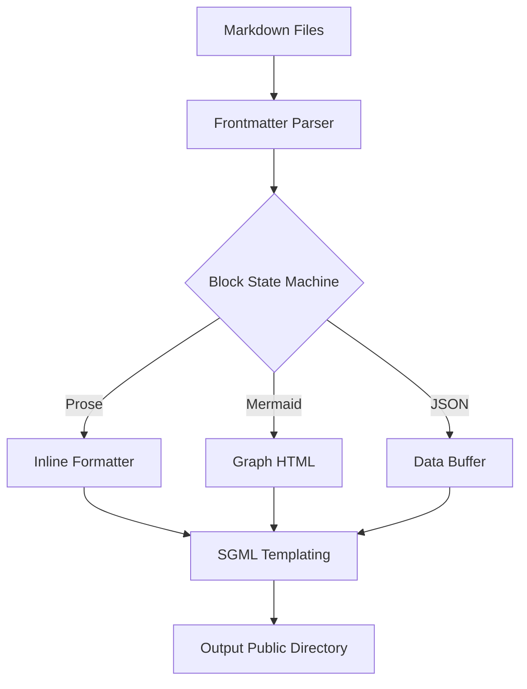

# Building our own Static Site Generator

This post covers how the **SSG Engine** operates under the hood. The system uses a block-aware markdown parser.

## Architecture Diagram

The system follows a simple linear flow:



## Configuration Data

Here is a block to test the JSON reference parser:

```json
{
  "repository": "personal-ssg-odin",
  "language": "Odin",
  "features": [
    "markdown",
    "mermaid",
    "templates"
  ]
}
```

The system is now back into PROSE state. **Testing bold text** again to make sure inline formatting doesn't break after exiting a code block state.

## Conclusion

Building your own SSG in Odin is fun because of the explicit memory layout and fine-grained control over parsing.
