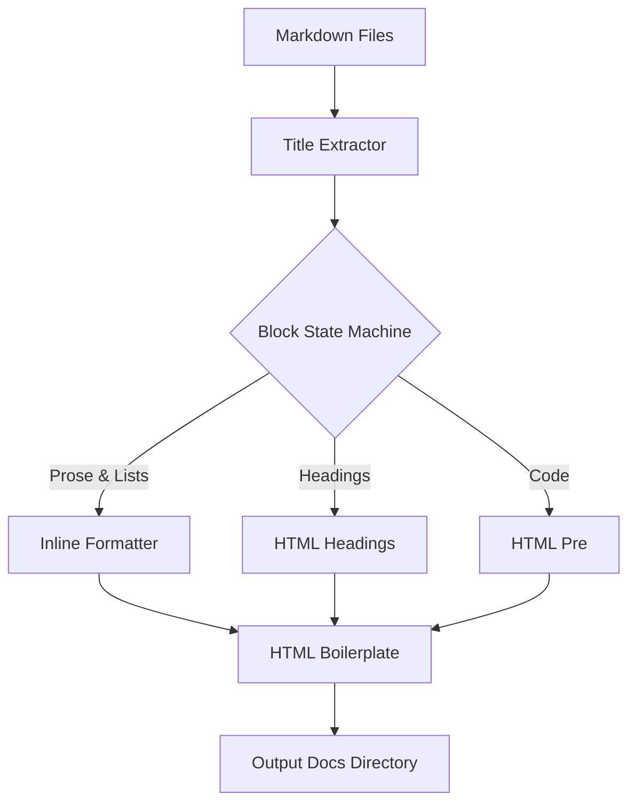

# Building our own Static Site Generator

This post covers how the **SSG Engine** operates under the hood. I decided to use this project as a way to learn the Odin language, as well as make something unique for my own cv and thoughts, The system uses a block-aware markdown parser.

## Architecture Diagram

The system follows a simple linear flow, since basically the conversion from markdown to HTML is straightforward:

## Inline Formatting

The system parses basic markdown features like **bold text** and links using an internal inline parser string builder. The parser transitions back into PROSE state after lists or code blocks, ensuring inline tags are always properly resolved.

## Conclusion

Building your own SSG is very simple and for now, it fits my current needs. If you have a minimal of expertise, you can just build your own things, instead of relying over more complex solutions, where you just use 5-10% of the features, and have to deal with the complexity of the tool. If my needs increase in the future, I will just need to adapt the code of the SSG. 
